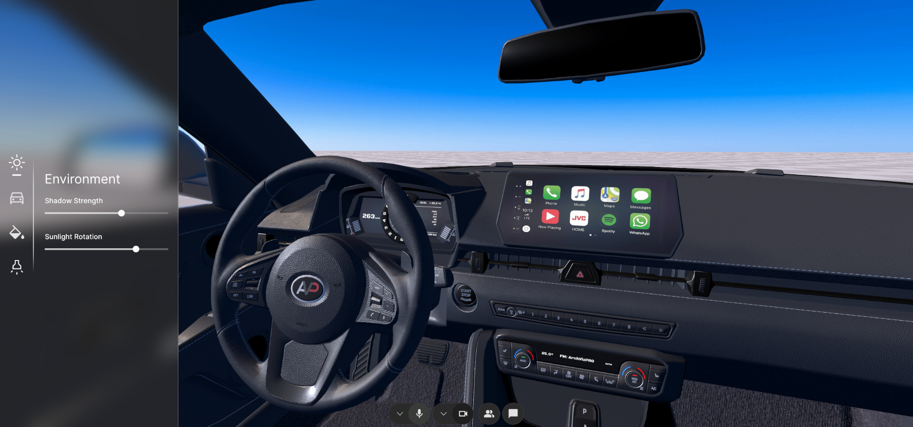

    

# 
Cavrnus Spatial Connector: Unity Car Configurator

<h4 align="center">
  
  
  
  
</h4>

### Getting Started
This Unity project leverages the [Cavrnus Spatial Connector](https://cavrnus.atlassian.net/wiki/spaces/CSM/overview) to provide essential tools for building a configurator with multi-user collaboration.

Follow these steps to get started:

1. **Install Unity**  
   Download and install **Unity version 2022.3.50f1 (URP)** from the [Unity Hub](https://unity.com/download).

2. **Clone or Download the Project**  
   Clone the repository from your source control system or download the project files as a ZIP.

3. **Open the Project in Unity**  
   - Launch Unity Hub.
   - Click the **Add** button and select the downloaded project folder.
   - Open the project with Unity 2022.3.50f1.

4. **Check URP Settings**  
   - Ensure the project is set up with the **Universal Render Pipeline (URP)**.
   - Verify the URP settings under **Edit > Project Settings > Graphics**.

5. **Select CavrnusMultiplayerGameSample Scene**
    - Open scene located at Assets/Car Configurator Scene

6. **Setup Cavrnus Spatial Connector**
    - The default scene already includes a Cavrnus Spatial Connector, but server settings and member login info must be setup. 
    - For in-depth help with setting up the Cavrnus Spatial Connector prefab, see [Setup Your Scene](https://cavrnus.atlassian.net/wiki/spaces/CSM/pages/827916295/Setup+Your+Scene) documentation.

7. **Run the Project** 
   - Press **Play** in the Unity Editor to run the scene.

## Full API Reference
The Cavrnus Spatial Connector includes an [API reference](https://cavrnus.atlassian.net/wiki/spaces/CSM/pages/824934449/API+Reference+Unity). Build more custom features to support your project!

## Support and Feedback
Do you need help? Have you found a bug? Reach out through the [Cavrnus Discord](https://discord.gg/AzgenDT7Ez).